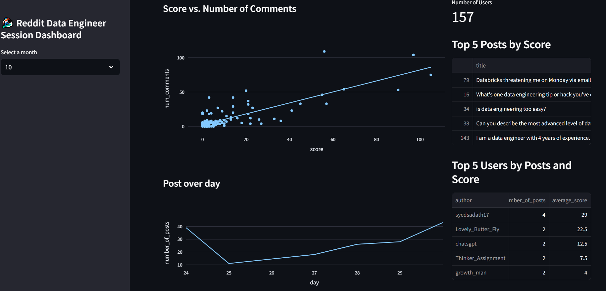
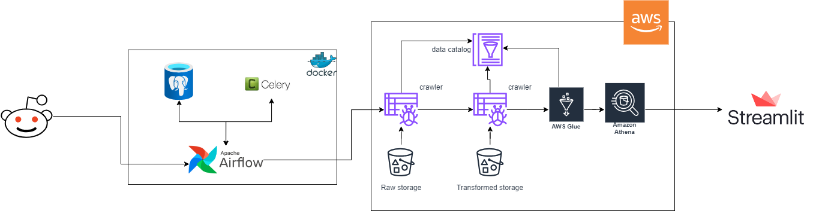

# Data Pipeline with Reddit API, Airflow, Postgres, S3, AWS glue, Athena, Streamlit
This project provides a comprehensive data pipeline solution to extract, transform, and load (ETL) Reddit data into a Redshift data warehouse. The pipeline leverages a combination of tools and services including Apache Airflow, Celery, PostgreSQL, Amazon S3, AWS Glue and Amazon Athena.

## Table of content
- [Overview](#overview)
- [Architecture](#architecture)
- [Prerequisites](#prerequisites)
- [System setup](#system-setup)

## Overview
The pipeline is designed to:

1. Extract data from Reddit using its API.
2. Store the raw data into an S3 bucket from Airflow.
3. Transform the data using AWS Glue and Amazon Athena.
4. Load the transformed data into AWS Glue data catalog and use its API to querying.
5. Show the result into dashboard by Streamlit.

**Dashboard in streamlit**:

## Architecture

## Prerequisites
- AWS Account with appropriate permissions for S3, Glue, Athena.
- Reddit API credentials.
- Docker Installation
- Python 3.9 or higher
## System setup
1. Clone the repository
    ```
    git clone https://github.com/TonND-6572/reddit_etl.git
    ```
2. Create a virtual environment
    ```
    python3 -m venv env
    ```
3. Activate the virtual environment
    - **Window command:**
        ```
        env/Script/activate
        ```
    - **Linux/Mac OS command:**
        ```
        source env/bin/activate
        ```
4. Install the dependencies
    ```
    pip install -r requirements.txt
    ```
    **Optional**: you can create additional environment for launch streamlit
    ```
    python3 -m venv streamlit-env python=3.9
    env/Script/activate # or 'source env/bin/activate' if you use Linux/Mac OS
    pip install -r streamlit_package.txt
    ```
5. Rename the configuration file and the credentials
    ```
    mv config/config.conf.template config/config.conf
    mv config/credentials.template credentials
    ```
6. Staring the container
    ```
    docker compose up -d
    ```
7. Launch Airflow web UI
    ```
    open http://localhost:8080
    ```
8. Launch Streamlit webapp
    ```
    streamlit run dashboard/dashboard.py
    ```